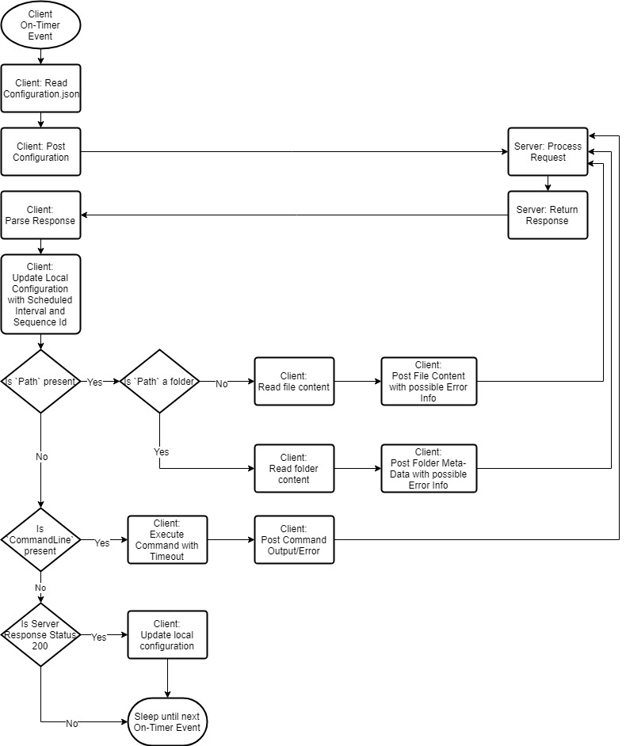

# Overview

* TWI Client is an unattended bot running in the background as a Windows Service to upload files, collect folder meta-data, and to execute shell commands on the client
* Server side is fully in control of the client behaviour, updating client's configuration and instructing what file/folder to upload or what command to execute 
* Client provides no user interface for the end-user to configure

## Flow Diagram



## Configuration.json

* Each client location will use a unique configuration file
* Setup process will distribute unique confiuration file

## Client Requests

### Http-Verb

* All requests will use POST verb to the uri from the configuration/server response json


### Current Configuration (Request #1)

```
{
  "LocationKey": "New Site Install",
  "DerivedMachineHash": "a3d61dcd929f262dc652ffce4ef61231",
  "ScheduledIntervalSec": "15",
  "FileSizeLimitMb": "501",
  "ImmutabilityIntervalSec": "2",
  "ThreadTimeToLiveSec": "5",
  "SequenceId": "1397608612",
  “ObjectType”:  “none”,
  "Uri": "http://transactionalweb.com/ienterprise/pollrequest.htm",
  "IgnoreSizeLimit": "False",
  "IgnoreImmutabilityInterval": "False",
  "SendVersionAfterTimeStampUtc": "1970-01-01T01:01:40"
}
```

### Post a file (Request #2)

```
{
  "LocationKey": "New Site Install",
  "DerivedMachineHash": "a3d61dcd929f262dc652ffce4ef61231",
  "SequenceId": "1397608612",
  "ObjectType": "File",
  "FileContent": "long-base64encoded-string",
  "FileSize": "1234578",
  "Path": "C:\\Temp\\Configuration.json",
  "Modified": "2013-01-01-T00:00:00"
}
```

### Post folder meta-data (Request #3)

```
{
  "LocationKey": "New Site Install",
  "DerivedMachineHash": "a3d61dcd929f262dc652ffce4ef61231",
  "SequenceId": "1397608612",
  "ObjectType": "Folder",
  "FolderSize": "1234578",
  "SubFoldersCount": "35",
  "FileCount": "3",
  "SubFolders": [
    {"Path": "C:\\Temp\\_1"},
    {"Path": "C:\\Temp\\_2}"
  ],
  "Files": [
    { "Path": "C:\\Temp\\_1\\aa.txt" },
    { "Path": "C:\\Temp\\_2\\bb.tmp" }
  ],
  "Path": "C:\\Temp",
  "Modified": "2013-01-01-T00:00:00"
}
```

### Execute Command (Request #4)

```
{
  "LocationKey": "New Site Install",
  "DerivedMachineHash": "a3d61dcd929f262dc652ffce4ef61231",
  "SequenceId": "1397608612",
  "ObjectType": "Command",
  "CommandLine": "dir C:\\"
  "CommandExitCode": 1,
  "CommandOutput": "long-text"
}
```

## Server Responses

### Update configuration only

```
{
  "LocationKey": "New Site Install",
  "DerivedMachineHash": "a3d61dcd929f262dc652ffce4ef61231",
  "ScheduledIntervalSec": "15",
  "FileSizeLimitMb": "501",
  "ImmutabilityIntervalSec": "2",
  "ThreadTimeToLiveSec": "5",
  "SequenceId": "1397608612",
  "ObjectType":  "None",
  "Uri": "http://transactionalweb.com/ienterprise/pollrequest.htm",
  "IgnoreSizeLimit": "False",
  "IgnoreImmutabilityInterval": "False",
  "SendVersionAfterTimeStampUtc": "1970-01-01T01:01:40"
}
```

### Upload file

```
{
  "LocationKey": "New Site Install",
  "DerivedMachineHash": "a3d61dcd929f262dc652ffce4ef61231",
  "ObjectType":  "File",
  "SequenceId": "1397608612",
  "Uri": "http://transactionalweb.com/ienterprise/pollrequest.htm",
  "IgnoreSizeLimit": "False",
  "IgnoreImmutabilityInterval": "False",
  "SendVersionAfterTimeStampUtc": "1970-01-01T01:01:40",
  "Path": "C:\\Temp\\Configuration.json"
}
```

### Upload folder meta-data

```
{
  "LocationKey": "New Site Install",
  "DerivedMachineHash": "a3d61dcd929f262dc652ffce4ef61231",
  "ObjectType":  "Folder",
  "SequenceId": "1397608612",
  "Uri": "http://transactionalweb.com/ienterprise/pollrequest.htm",
  "Path": "C:\\Temp"
}
```

### Execute Command
```
{
  "LocationKey": "New Site Install",
  "DerivedMachineHash": "a3d61dcd929f262dc652ffce4ef61231",
  "SequenceId": "1397608612",
  "ObjectType":  "Command",
  "UrlPostFile": "http://transactionalweb.com/ienterprise/pollrequest.htm",
  "CommandLine": "dir C:"
}
```
* ThreadTimeToLive settings will limit command line execution


## Development Setup

* Windows Server 2016 Base, may work on other modern Windows OS
* Install [Visual Studio 2017 Community Edition](https://visualstudio.microsoft.com/downloads/)
* Install [Wix Toolset](http://wixtoolset.org/releases/)
* Insttall Wix Toolset VS2017 Extension from Tools->Extensions and Updates
